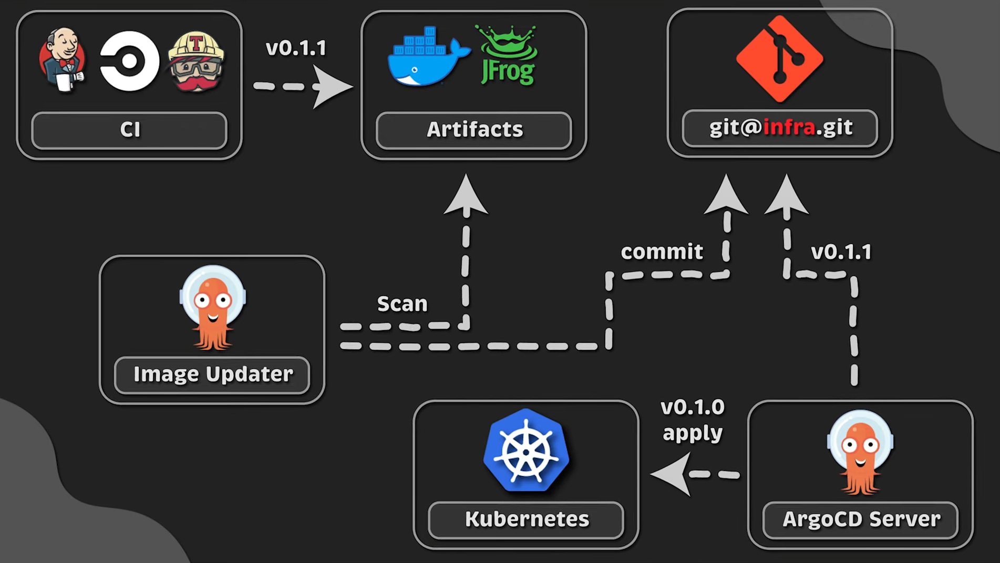
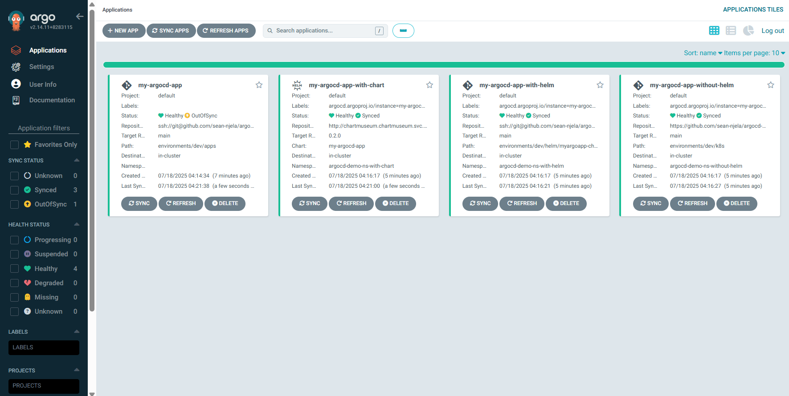

<div align="center">

  
  <h1>Argo CD Personal Project</h1>
  
  <p>
    A professional portfolio project showcasing GitOps implementation with Argo CD, Kubernetes, Sealed Secrets, Notifications, and Infrastructure as Code. This project demonstrates DevOps best practices using modern tools and techniques with a security first mindset.

    The project uses Terraform to provision Argo CD into a Kind cluster, implements the App of Apps pattern, and leverages Helm charts for application deployment.
  </p>
  
<p>
  <a href="https://github.com/sean-njela/argocd-demo/graphs/contributors">
    
  </a>
  <a href="">
    
  </a>
  <a href="https://github.com/sean-njela/argocd-demo/network/members">
    
  </a>
  <a href="https://github.com/sean-njela/argocd-demo/stargazers">
    
  </a>
  <a href="https://github.com/sean-njela/argocd-demo/issues/">
    
  </a>
  <a href="https://github.com/sean-njela/argocd-demo/blob/master/LICENSE">
    
  </a>
</p>

</div>

<br />

## Table of Contents

  * [Screenshots](#screenshots)
  * [Tech Stack](#tech-stack)
  * [Features](#features)
  * [Prerequisites](#prerequisites)
  * [Usage](#usage)
  * [Roadmap](#roadmap)
  * [License](#license)
  * [Contact](#contact)

## Screenshots

<div align="center"> 
  
  
</div>

## Tech Stack


## Features

- Argo CD for Continuous delivery for Kubernetes applications
- Terraform for Infrastructure as Code
- Taskfiles for repeatable tasks

## Prerequisites

This project uses [Devbox](https://www.jetify.com/devbox/) to manage the development environment. Devbox provides a consistent, isolated environment with all the necessary tools pre-installed.

### Required Tools

0. **install Docker**
   - Follow the [installation instructions](https://docs.docker.com/get-docker/) for your operating system

> The rest of the tools are installed using devbox

1. **Install Devbox**
   - Follow the [installation instructions](https://www.jetify.com/devbox/docs/installing_devbox/) for your operating system

2. **Clone the Repository**
   ```bash
   git clone https://github.com/sean-njela/argocd-demo.git
   cd argocd-demo
   ```

3. **Start the Devbox Environment and poetry environment**
   ```bash
   devbox shell # Start the devbox environment
   poetry install # Install dependencies
   poetry env activate # use the output to activate the poetry environment
   mkdocs serve # Start the mkdocs server http://127.0.0.1:8000/argocd-demo/
   ```
> Note - The first time you run `devbox shell`, it will take a few minutes to install the necessary tools. But after that it will be much faster.

## Usage

This project is designed for a simple, one-command setup. All necessary actions are orchestrated through `Taskfile.yml`.

There are 2 application.yaml files:

1. `0-application.yaml` - This is the application.yaml file with app of apps pattern, TF, sealed secrets and helm.
2. `1-application.yaml` - This is the application.yaml file *WITHOUT* app of apps pattern, TF, sealed secrets and helm.


#### 🚀 Quick Start

To create the local Kubernetes cluster and deploy Argo CD, simply run:

```sh
task ssh-keygen 
```
Then copy the private key to the `0-repo-secret.yaml` file for argocd-image-updater. Then copy the public key to the deploy key section in the github repo. Then run the next command. 

```sh
task dev
```

This single command will:
1. Create a local Kind cluster (if it's not already running).
2. Deploy Argo CD using the Terraform configuration.
3. Bootstrap argocd application using 1-sealed-secrets.yaml (this is generated by kubeseal and is the secret argocd will use to update the image in the github repo).
4. Bootstrap argocd application using 0-application.yaml (this is the application.yaml file with app of apps pattern, TF and helm).
5. Expose cluster kubeconfig for tools like lens
6. Add argocd helm repo

Then run:

```sh
task port-fwd-argocd
```

You can now access the Argo CD UI at http://localhost:8080 with username `admin` and for the password run(in a seperate terminal):

```sh
task argocd-init-passwd
```

Then in a seperate terminal window run:

```sh
task helm-package-push
```

Then run:

```sh
task docs # This will serve the docs locally at http://127.0.0.1:8000/argocd-demo/
```

Use the following command to clean up the cluster and terraform resources:

```sh
task cleanup
```
This will delete the cluster and terraform resources.

#### Other Available Commands

> To see a full list of all available tasks, run `task --list-all`

### Git Workflow with Git Flow

The `Taskfile.gitflow.yml` provides a structured Git workflow using Git Flow. This helps in managing features, releases, and hotfixes in a standardized way.

> use `task -t Taskfile.gitflow.yml --list-all` to see all gitflow tasks

### Kubernetes Manifests

The `environments/dev/k8s` directory contains simple Kubernetes manifests for the sample application

The `environments/dev/helm` directory contains Helm charts for the same application (default in use)

## Roadmap
* [x] ArgoCD implementation
* [x] Terraform infrastructure as code
* [x] Helm chart integration
* [x] App of apps pattern
* [x] Comprehensive documentation
* [ ] ArgoCD Image Updater
* [ ] Deployment freezing
* [ ] Notification system

## NOTES
- The `1-application.yaml` file is the same as the `0-application.yaml` it is the file we used initially before we added the app of apps pattern, tf and helm
- We number the files because we will be adding more and more files in the future
- With TF we can customise the values of the helm chart on creation. To check which values we can edit, use helm show e.g `helm show values argocd/argocd-image-updater > image-updater-values.yaml` to check the values. Then specify in a values.yaml in the values folder the values you want to override.
- SPECIFY A VALUES FILE IN THE TF VALUES FOLDER, ONLY WHEN NECESSARY

## Documentation

Comprehensive documentation is available in the `docs/` directory. You can view it locally by running:

```bash
mkdocs serve # make sure you are in the poetry environment (check prerequisites)
```

Then navigate to [http://127.0.0.1:8000/argocd-demo/](http://127.0.0.1:8000/argocd-demo/)

The documentation covers:
- Project architecture
- ArgoCD implementation details
- Application deployment process
- Environment management
- Terraform infrastructure
- Helm chart structure
- Automation with Task runner

## Contributors

<a href="https://github.com/sean-njela/argocd-demo/graphs/contributors">
  
</a>

> Contributions are always welcome!

## License

Distributed under the MIT License. See `LICENSE` for more information.

## Contact

Sean Njela - [X/twitter](https://x.com/devopssean) - [email](mailto:seannjela@gmail.com)

Project Link: [https://github.com/sean-njela/argocd-demo](https://github.com/sean-njela/argocd-demo)