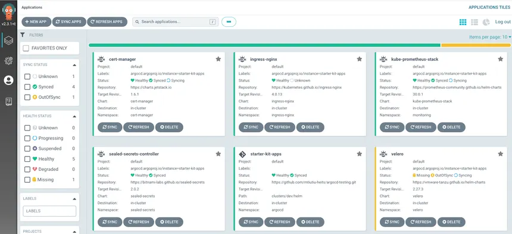

<div align="center">

  
  <h1>Argo CD Personal Project</h1>
  
  <p>
    This is a personal project to showcase my Argo CD knowledge. I am using this project to learn Argo CD and to build applications that I can use to test Argo CD. I will keep adding more applications to this project as I learn more about Argo CD.

  </p>
  
<p>
  <a href="https://github.com/sean-njela/argocd-demo/graphs/contributors">
    
  </a>
  <a href="">
    
  </a>
  <a href="https://github.com/sean-njela/argocd-demo/network/members">
    
  </a>
  <a href="https://github.com/sean-njela/argocd-demo/stargazers">
    
  </a>
  <a href="https://github.com/sean-njela/argocd-demo/issues/">
    
  </a>
  <a href="https://github.com/sean-njela/argocd-demo/blob/master/LICENSE">
    
  </a>
</p>

</div>

<br />

## Table of Contents

  * [Screenshots](#screenshots)
  * [Tech Stack](#tech-stack)
  * [Features](#features)
  * [Prerequisites](#prerequisites)
  * [Usage](#usage)
  * [Roadmap](#roadmap)
  * [License](#license)
  * [Contact](#contact)

## Screenshots

<div align="center"> 
  
</div>

## Tech Stack


## Features

- Continuous delivery for Kubernetes applications
- GitOps for Kubernetes applications
- Taskfiles for repeatable tasks

## Prerequisites

This project uses [Devbox](https://www.jetify.com/devbox/) to manage the development environment. Devbox provides a consistent, isolated environment with all the necessary tools pre-installed.

### Required Tools

1. **Install Devbox**
   - Follow the [installation instructions](https://www.jetify.com/devbox/docs/installing_devbox/) for your operating system

2. **Clone the Repository**
   ```bash
   git clone https://github.com/sean-njela/argocd-demo.git
   cd argocd-demo
   ```

3. **Start the Devbox Environment**
   ```bash
   devbox shell
   ```

## Usage

This project uses `Taskfile.yml` for managing the local development environment and `Taskfile.gitflow.yml` for Git workflow. Below is a detailed guide on how to use them.

### Environment Setup and Application Management

The `Taskfile.yml` contains tasks for setting up your local Kubernetes cluster and deploying Argo CD.

- **`task create-cluster`**: Creates a local `kind` cluster named `argocd-demo`.
- **`task expose-kubeconfig`**: Exports the `kubeconfig` for the `kind` cluster to a file named `config-kind-dev.txt`, allowing you to connect to the cluster with tools like Lens.
- **`task install-argocd`**: Installs Argo CD into the `argocd` namespace and forwards port `8080` to the Argo CD server, making it accessible at `localhost:8080`.
- **`task ports`**: Lists all in-use ports.

### Git Workflow with Git Flow

The `Taskfile.gitflow.yml` provides a structured Git workflow using Git Flow. This helps in managing features, releases, and hotfixes in a standardized way.

- **`task gitflow:init`**: Initializes Git Flow for the repository.
- **`task gitflow:feature:start name=<feature-name>`**: Starts a new feature branch.
- **`task gitflow:feature:push`**: Pushes the current feature branch to the remote repository.
- **`task gitflow:feature:clean`**: Deletes the local feature branch after it has been merged.
- **`task gitflow:release:start version=<version>`**: Starts a new release branch.
- **`task gitflow:release:finish version=<version>`**: Finishes a release, which merges the release branch into `main` and `develop`, and tags the release.
- **`task gitflow:hotfix:start version=<version>`**: Starts a new hotfix branch.
- **`task gitflow:hotfix:finish version=<version>`**: Finishes a hotfix.

### Kubernetes Manifests

The `k8s` directory contains the Kubernetes manifests for the sample application:

- **`deployment.yml`**: Defines the deployment for the application.
- **`service.yml`**: Defines the service to expose the application.


## Roadmap

* [ ] Helm 
* [ ] App of apps pattern
* [ ] Image updater
* [ ] Deployment freezing   
* [ ] 

## Contributors

<a href="https://github.com/sean-njela/argocd-demo/graphs/contributors">
  
</a>

> Contributions are always welcome!

## License

Distributed under the MIT License. See `LICENSE` for more information.

## Contact

Sean Njela - [X/twitter](https://x.com/devopssean) - [email](mailto:seannjela@gmail.com)

Project Link: [https://github.com/sean-njela/argocd-demo](https://github.com/sean-njela/argocd-demo)