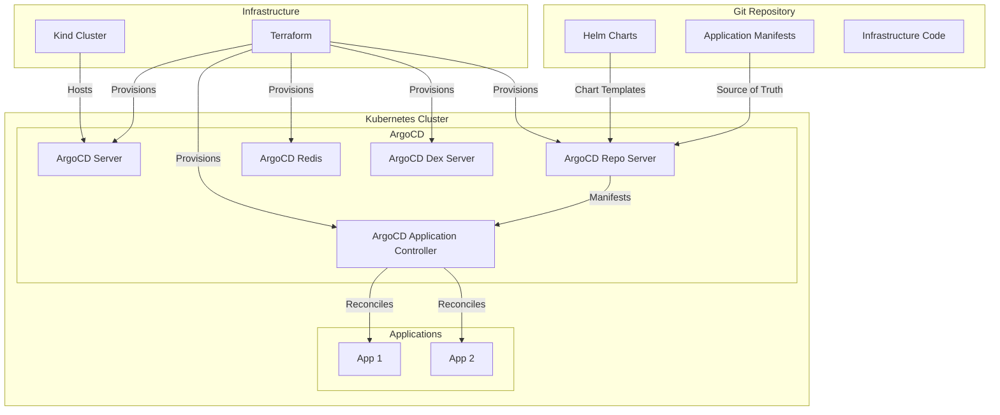

# System Architecture Overview

This document provides a high-level overview of the ArgoCD demonstration project architecture, explaining how the various components interact to implement GitOps principles.

## Architecture Diagram



## Core Components

### Git Repository

The Git repository serves as the single source of truth for the entire system, containing:

- **Application Manifests**: Kubernetes manifests defining the desired state of applications
- **Helm Charts**: Templated application packages for consistent deployment
- **Infrastructure Code**: Terraform configurations for provisioning infrastructure

### ArgoCD

ArgoCD is the GitOps continuous delivery tool that ensures the cluster state matches the desired state defined in Git:

- **ArgoCD Server**: Provides the API and UI for managing applications
- **Repo Server**: Responsible for cloning Git repositories and generating Kubernetes manifests
- **Application Controller**: Monitors running applications and compares their state to the desired state
- **Redis**: Caches repository information and serves as a shared cache
- **Dex Server**: Optional component for SSO authentication

### Kubernetes Cluster

The Kubernetes cluster is created using Kind (Kubernetes in Docker) for local development:

- **Control Plane**: Manages the cluster state and API
- **Worker Nodes**: Run the application workloads
- **Namespaces**: Logical separation of applications and components

### Infrastructure Management

- **Terraform**: Provisions and configures ArgoCD in a reproducible manner
- **Task Runner**: Automates common operations and workflows

## Workflow

1. **Development**: Changes are made to application code or configuration in Git
2. **Commit & Push**: Changes are committed and pushed to the Git repository
3. **Detection**: ArgoCD detects changes in the Git repository
4. **Comparison**: ArgoCD compares the desired state with the current state
5. **Reconciliation**: ArgoCD applies changes to bring the cluster to the desired state
6. **Monitoring**: ArgoCD continuously monitors for drift between desired and actual state

## Environment Structure

The project supports multiple environments through directory structure:

```
environments/
├── dev/
│   ├── apps/
│   │   ├── app1/
│   │   └── app2/
│   └── helm/
│       └── myargoapp-chart/
└── README.md
```

Each environment contains:
- Application-specific configurations
- Environment-specific values
- Helm charts for templated applications

## Security Considerations

- **RBAC**: Role-Based Access Control for ArgoCD and Kubernetes resources
- **Secure Defaults**: ArgoCD is configured with secure default settings
- **Least Privilege**: Components operate with minimal required permissions
- **Secrets Management**: Sensitive information is properly managed

## Scalability

While this demonstration uses a single-node Kind cluster, the architecture is designed to be scalable:

- **Horizontal Scaling**: Applications can be scaled horizontally
- **Multi-Environment**: Structure supports multiple environments (dev, staging, prod)
- **Multi-Cluster**: ArgoCD can manage multiple Kubernetes clusters

## Related Documentation

- [Infrastructure with Terraform](../infrastructure/terraform.md)
- [ArgoCD Applications](../argocd/applications.md)
- [ArgoCD Overview](../argocd/overview.md)