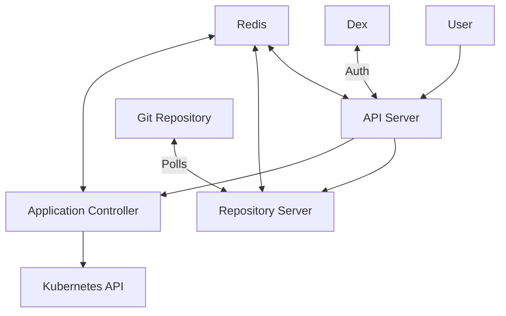

# ArgoCD Overview

This document provides a comprehensive overview of ArgoCD as implemented in this project, explaining its components, architecture, and how it enables GitOps workflows.

## What is ArgoCD?

ArgoCD is a declarative, GitOps continuous delivery tool for Kubernetes. It automates the deployment of applications to Kubernetes by keeping the cluster state in sync with configuration stored in Git repositories.

## Core Principles

The implementation in this project adheres to the following GitOps principles:

1. **Declarative Configuration**: All system configurations are defined declaratively
2. **Version Controlled**: All configurations are stored in Git
3. **Automated Synchronization**: Changes to the desired state are automatically applied
4. **Self-Healing**: System continuously attempts to converge to the desired state
5. **Observability**: System state and history are observable and auditable

## ArgoCD Architecture



### Components

- **API Server**: REST API server that exposes the API consumed by the Web UI, CLI, and CI/CD systems
- **Repository Server**: Internal service that maintains a local cache of Git repositories
- **Application Controller**: Kubernetes controller that continuously monitors running applications and compares their state against the desired state
- **Redis**: Caches repository data and serves as a shared cache for the API server and application controller
- **Dex**: Optional OpenID Connect provider for SSO integration

## Installation

In this project, ArgoCD is installed using Terraform with the official Helm chart:

```hcl
resource "helm_release" "argocd" {
    name = "argocd"
    repository = "https://argoproj.github.io/argo-helm"
    chart = "argo-cd"
    version = "3.35.4"
    namespace = "argocd"
    create_namespace = true
    values = [file("values/argocd-values.yaml")]
}
```

The installation creates the following resources:
- ArgoCD namespace
- Core ArgoCD components (server, repo server, application controller)
- RBAC resources
- Service accounts
- ConfigMaps for configuration
- Secrets for sensitive data

## Application Definition

Applications in ArgoCD are defined using the `Application` custom resource:

```yaml
apiVersion: argoproj.io/v1alpha1
kind: Application
metadata:
  name: myapp
  namespace: argocd
spec:
  project: default
  source:
    repoURL: https://github.com/sean-njela/argocd-demo.git
    targetRevision: HEAD
    path: environments/dev/apps/myapp
  destination:
    server: https://kubernetes.default.svc
    namespace: myapp
  syncPolicy:
    automated:
      prune: true
      selfHeal: true
```

Key fields in an Application definition:
- **source**: Where the application manifests are stored
- **destination**: The target Kubernetes cluster and namespace
- **syncPolicy**: How ArgoCD should sync the application

## Sync Strategies

This project demonstrates several sync strategies:

1. **Manual Sync**: Changes are applied only when manually triggered
2. **Automated Sync**: Changes are automatically applied when detected
3. **Self-Healing**: Drift from the desired state is automatically corrected
4. **Pruning**: Resources no longer defined in Git are removed

## Application Projects

ArgoCD Projects provide a logical grouping of applications and define constraints for:
- Source repositories
- Destination clusters and namespaces
- Permitted resource kinds
- Parameters that can be set

## User Interface

The ArgoCD UI provides:
- Application dashboard
- Application details and status
- Sync and rollback operations
- Resource tree view
- Application logs
- Events and history

Access the UI by running:
```bash
task forward-argocd-ui
```

Then navigate to [http://localhost:8080](http://localhost:8080).

## CLI Access

ArgoCD provides a CLI for interacting with applications:

```bash
# Login to ArgoCD
argocd login localhost:8080

# List applications
argocd app list

# Get application status
argocd app get myapp

# Sync an application
argocd app sync myapp
```

## Security Considerations

This implementation includes several security best practices:

- RBAC for access control
- Secure admin password generation
- TLS for API server (in production)
- Resource constraints
- Least privilege principle

## Monitoring and Observability

ArgoCD provides several ways to monitor applications:

- Health status in the UI
- Application events
- Resource tree with status
- Sync history
- Integration with Prometheus (in production)

## Related Documentation

- [Application Deployment](applications.md)
- [Environment Management](environments.md)
- [System Architecture](../architecture/overview.md)
- [Infrastructure with Terraform](../infrastructure/terraform.md)
