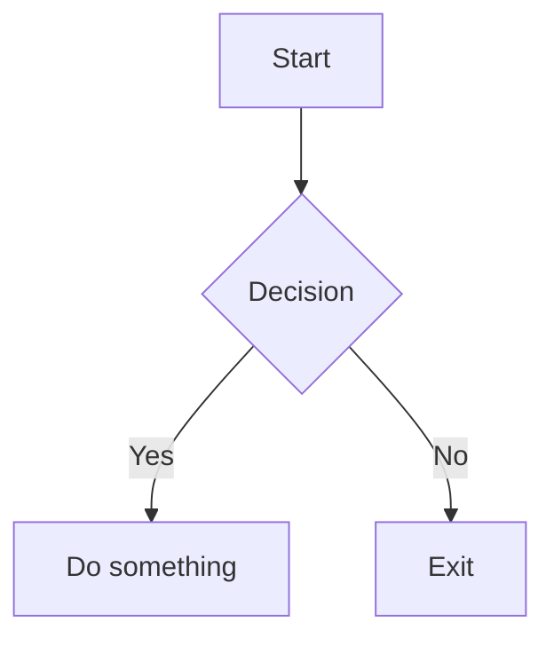

# Welcome to my ArgoCD project documentation

> Clean, versioned, developer-friendly.

## Commands

* `mkdocs new [dir-name]` - Create a new project.
* `mkdocs serve` - Start the live-reloading docs server.
* `mkdocs build` - Build the documentation site.
* `mkdocs -h` - Print help message and exit.

## 📁 Structure

- 📐 Architecture
- 🛠️ How-To Guides
- ⚙️ CLI Docs
- 📚 Internal API Reference

# Example Diagram

